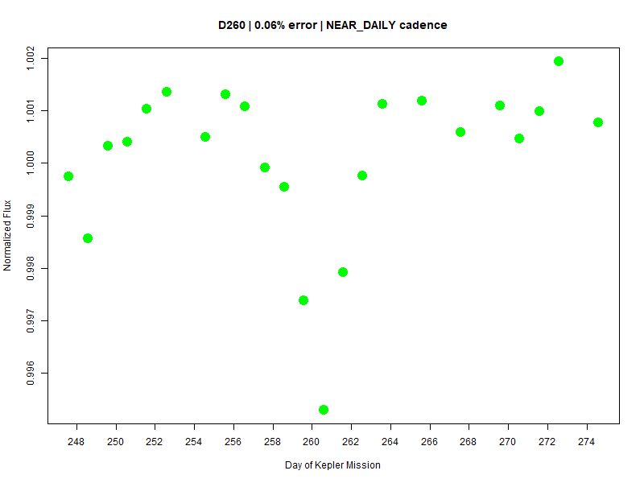
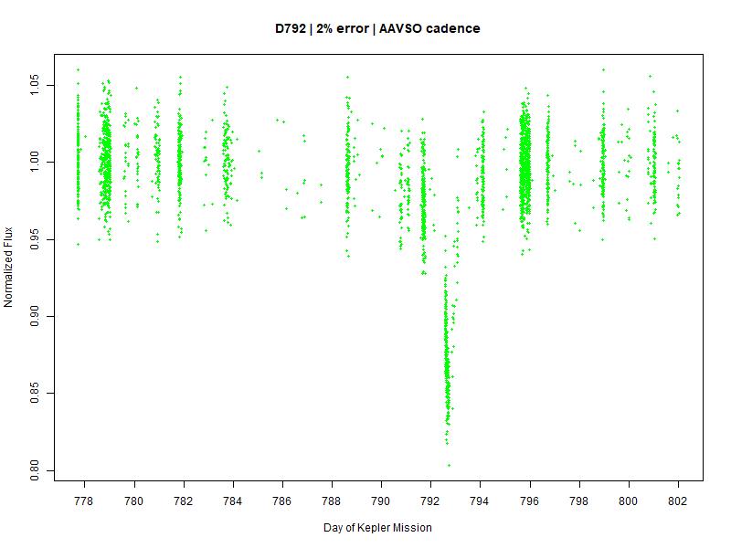
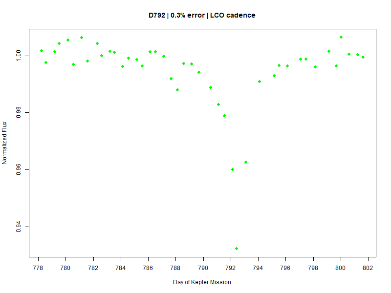
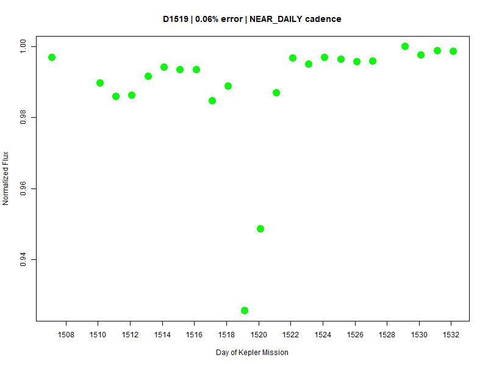
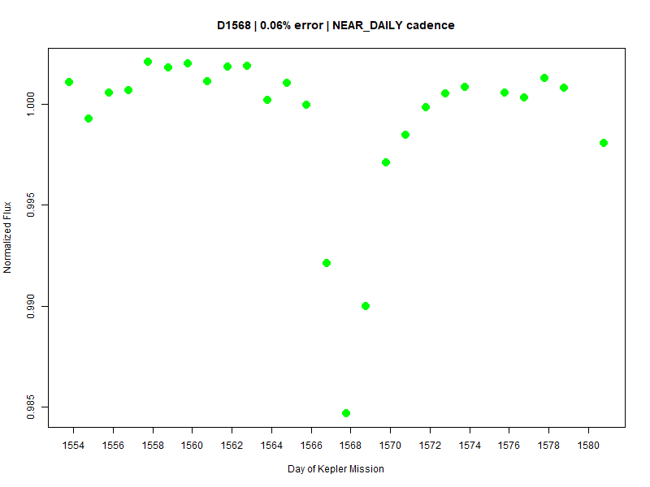

# KIC 8462852 Kepler Dips with Longer Cadence and High Uncertainty

Subfolders contain light curve charts resulting from 12 sets of 10 simulation runs. Each set is a combination of a dip and a cadence-uncertainty pair.

## Dips

* D260 (~0.5%)
* D792 (~15%)
* D1519 (~21%)
* D1568 (~9%)

## Cadence-uncertainty pairs

* "AAVSO": Standard error of 2% and cadence like AAVSO's in 2017.
* "LCO": Standard error of 0.3% and cadence like LCO's in 2017.
* "NEAR_DAILY": Standard error of 0.06% and daily cadence where 25% of days are missed (intended to be similar to Bruce Gary.)

## D260 analysis

D260 can apparently only be picked up convincingly by Bruce Gary. Example:

## D792 analysis

D792 can easily be missed entirely by AAVSO. If an observer were fortunate enough to pick D792 up at near peak, it would look as follows:

This is consistent with the AAVSO dip from May 4, 2016.

D792 should be observable by both LCO and Bruce Gary. LCO would typically report it as a 5% to 10% dip. Bruce Gary might pick it up as a 3% to 6% dip. Example:

# D1519 analysis

D1519 can also be missed by AAVSO, like D792, but it's more probable that multiple observers would pick it up.

LCO should typically record the full depth of D1519. Bruce Gary might be able to do that too, but sometimes he would
only observe a 5% to 10% dip. Example:

# D1568 analysis

It would seem that the normal AAVSO expectation relative to D1568 is that it would miss the dip entirely.

LCO seemingly misses D1568 in one of the 10 simulations, but otherwise is able to pick it up, often at full depth,
although depths of 5% to 6% are common.

Bruce Gary simulations are similar. One in 10 is not a convincing dip. Otherwise, typical depth is 2% to 5%. Example:

